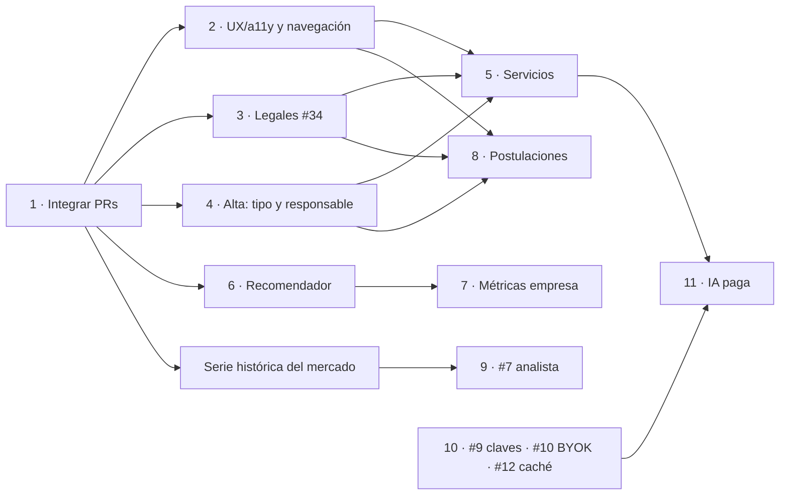

# Plan de implementación

Foto al 29 de septiembre de 2026. Ordena lo pendiente del
[`roadmap.md`](roadmap.md), los issues abiertos y los PRs sin mergear, y suma
una pasada de UX/UI y accesibilidad sobre lo que ya está en `develop`. Las
decisiones tomadas están al final, en [Decisiones](#decisiones).

El orden sale de cuatro criterios, en este orden de peso:

1. **Destrabar**: lo que ya está hecho y espera en un PR va primero; cada día
   que pasa suma conflictos.
2. **Dependencias**: nada entra antes que la pieza sobre la que se apoya.
3. **Quien busca trabajo primero**: es el público principal y el que no pide
   nada a cambio. Lo que mejora su uso diario le gana a lo que suma un público
   nuevo.
4. **Lo que cuesta plata al final**: todo lo que tiene costo por uso (IA, voz)
   espera a que existan los pagos, las claves y el caché.

Los tamaños son relativos: **S** (un par de días), **M** (una semana), **L**
(varias semanas).

| Fase | Qué | Tamaño |
|---|---|---|
| 1 | Integrar los PRs listos | M |
| 2 | Base de accesibilidad, UX y navegación | L |
| 3 | Privacidad y legales (#34) | S |
| 4 | Alta de empresa y emprendimientos | M |
| 5 | Servicios (#26, #38, #32, #33) | L |
| 6 | Recomendador personalizado | L |
| 7 | Métricas de empresa | M |
| 8 | Postulaciones con preguntas y conversación | L |
| 9 | Contenido (#3, #5, #7) | L |
| 10 | Plataforma: analítica propia, API, self-hosting | L |
| 11 | IA para empresas, plan pago | L |

Las fases 2, 3 y 4 corren en paralelo.

---

## 0. Dónde estamos

### PRs abiertos

Simulación de merge secuencial contra `origin/develop` (`git merge-tree`):

| PR | Rama | Base | Tamaño | Choca con `develop` |
|---|---|---|---|---|
| #44 | `fix/descripcion` | `develop` | +179 | No |
| — | `feat/empresa-perfil` (sin PR, con cambios sin commitear) | `develop` | 3 commits | No |
| #39 | `feat/mcp` | `develop` | +1.550 | `README.md` |
| #40 | `feat/ejercicios` | `develop` | +2.027 | No |
| #42 | `feat/faq-rubros` | `feat/ejercicios` | +865 | No |
| #46 | `feat/empresas` | `develop` | +852 | `api/src/index.ts`, `web/src/App.tsx` (con #40/#42) |
| #49 | `feat/atajos` | `feat/empresas` | +579 | Los mismos dos |
| #50 | `feat/ayuda` | `feat/atajos` | +984 | Los mismos dos |
| #38 | `feat/servicios` | `develop` | +8.593, 68 archivos | 11 archivos: `api/src/db.ts`, `index.ts`, `pages.ts`, `site.ts`, `deploy/nginx.conf`, `sitemap.xml`, `App.tsx`, `JobModal.tsx`, `vite.config.ts`, `worker/package.json`, `README.md` |
| #41 | `docs/pendientes` | `develop` | +493 | No |

### Issues que ya están resueltos (o casi) y siguen abiertos

| Issue | Qué hay en `develop` | Qué hacer |
|---|---|---|
| #13 Vista RAW | `api/src/raw.ts` (e67d685) | Verificar contra el issue y cerrar. |
| #14 Operar desde la CLI | `api/src/cli.ts` y la reescritura por User-Agent en nginx | Cerrar. |
| #15 Publicación directa | Panel de empresa mergeado (c537a86) | Cerrar; lo que falte va como issue nuevo. |
| #8 Métricas de uso | Eventos anónimos y panel de uso propios (`api/src/events.ts`, `usage.ts`) | Reescribir el issue como analítica propia exportable (fase 10). |
| #34 Legales | `terminos.html` y `privacidad.html` ya hablan de cuentas | Queda: la IP en el `access_log` de nginx y la sección verificable de Zero Data. |

Y los que cierran los PRs abiertos: #1 (#39), #4 (#40), #3 a nivel rubro
(#42; el nivel puesto queda abierto), #45 (#46), #47 (#49), #48 (#50).

---

## Fase 1 · Integrar lo que ya está hecho

**Por qué primero:** son ~6.000 líneas terminadas y probadas. Cada fase que
viene toca `App.tsx` y `JobModal.tsx`, y cada una que entre antes que estos PRs
les agrega conflictos.

Orden de merge (en cada paso: rebase o merge de `develop`,
`bun run typecheck`, `bun run lint`, `bun test`):

1. **#44** `fix/descripcion`. Limpio. **S**
2. **`feat/empresa-perfil`**: commitear lo de `Login.tsx` y `PhoneField.tsx`,
   abrir el PR y mergear. **S**
3. **#39** `feat/mcp`. Conflicto trivial en el README. **S**
4. **#40** `feat/ejercicios`, después **#42** retargeteado a `develop`. **S**
5. **#46** `feat/empresas`, resolviendo `index.ts` (registro de rutas) y
   `App.tsx` (pestañas y paneles) contra #40/#42. Después **#49** y **#50**,
   retargeteando cada uno a `develop` cuando entra el anterior. **M**
6. **#41**: cerrarlo a favor de este documento. Su plan ya se cumplió en #39,
   #40 y #42, y lo que falta (#5 y #7) está en la fase 9.
7. Cerrar los issues de la tabla de arriba.
8. **Empezar a guardar la serie histórica del mercado**: la foto diaria del
   informe, aunque nadie la muestre todavía. Es el prerrequisito de #7 y de las
   proyecciones de Novedades (#48), y cada día que no se guarda no se recupera.
   **S**

**#38 (servicios) no entra acá:** necesita las fases 3 y 4 terminadas, y
conviene que herede la fase 2 en vez de sumar otro modal sin foco.

---

## Fase 2 · Base de accesibilidad, UX y navegación

**Por qué ahora:** #50 suma un diálogo de ayuda y #38 una ficha de servicio con
el mismo patrón que `JobModal`, y los dos suman secciones. Arreglar las piezas
base una vez, antes de que se copien, es más barato que arreglarlas tres veces
después.

El detalle de cada hallazgo, con la evidencia, está en
[UX/UI y accesibilidad](#uxui-y-accesibilidad).

| Entrega | Hallazgos | Tamaño |
|---|---|---|
| 2.1 Tokens de color con contraste AA | A1 | S |
| 2.2 Primitiva `Dialog` y migración de todos los modales | A2, A3 | M |
| 2.3 Navegación por secciones: barra inferior en el teléfono | U3 | M |
| 2.4 Ficha de oferta en el teléfono (#37) | U2 | M |
| 2.5 Filtros plegables en el teléfono | U1 | M |
| 2.6 Validación en vivo con resumen de lo que falta | U8 | M |
| 2.7 Nombres accesibles, carga de teclado y copy | U4, U5, U6, U7, U9 | S |
| 2.8 Chequeo automático de accesibilidad en CI | — | S |

### 2.3 · Navegación por secciones

**Decidido:** en el teléfono, una barra inferior como la de una app, con las
secciones generales, y mini secciones adentro de cada una.

Por qué la barra inferior y no las otras dos opciones:

| Opción | A favor | En contra |
|---|---|---|
| **Barra inferior** | Siempre a la vista, al alcance del pulgar, un toque por sección. Es lo que la gente ya conoce de las apps. | Entran cinco secciones como mucho: obliga a agrupar, lo que igual hace falta. |
| Scroll horizontal | No obliga a agrupar. | Lo que no entra en pantalla no se ve, y nadie sabe que existe. |
| Menú hamburguesa | Entra todo. | Esconde la navegación detrás de un toque; lo que no se ve se usa menos. |

Estructura propuesta: cinco secciones, y cada una con mini secciones:

| Sección | Mini secciones |
|---|---|
| **Ofertas** | Todas · Estado (sector público) |
| **Servicios** | Explorar · Los míos (si publica) |
| **Mis ofertas** | Guardadas · Seguimiento · Postulaciones (fase 8) |
| **Mercado** | Resumen · Entrevistas (#3) · Recursos (#5) · Analista (#7) |
| **Novedades** | Para vos · Para arrancar · Cierres próximos · Del mercado |

Preferencias, cuenta y ayuda siguen en la isla de arriba.

- En escritorio, la misma estructura como pestañas arriba, con las mini
  secciones debajo. Una sola definición de secciones para los dos tamaños.
- La barra es un `<nav aria-label="Secciones">` con enlaces y
  `aria-current="page"`, no un `tablist`: cambiar de sección es navegar, y la
  URL ya lo refleja (`web/src/lib/url.ts`). Las mini secciones sí son
  pestañas, con el patrón completo de WAI-ARIA.
- Etiquetas siempre visibles bajo el ícono, blancos de 44 px como mínimo,
  `env(safe-area-inset-bottom)`, y un contador en Novedades y Mis ofertas.
- La barra se oculta mientras una hoja a pantalla completa (la ficha) está
  abierta, para no competir con su pie fijo.

### 2.6 · Validación en vivo

**Decidido:** los botones de enviar dejan de deshabilitarse. En su lugar, cada
formulario muestra **en vivo qué falta y qué no cierra**:

- Un resumen arriba del botón ("Falta: correo de contacto. Revisá: las
  contraseñas no coinciden."), en una región `aria-live="polite"`, que se
  actualiza mientras se escribe.
- Cada ítem del resumen es un enlace que lleva el foco al campo.
- **Faltante** (vacío y obligatorio) y **discrepante** (completo pero
  inconsistente) se muestran distinto. Ejemplos de discrepancias: el dominio
  del correo no coincide con el sitio web (aviso, no bloquea), las
  contraseñas no coinciden, el teléfono no tiene el largo del país elegido, el
  nombre ya existe en otra empresa.
- Al enviar con algo pendiente, el foco va al primer campo con error, como ya
  hace el alta por secciones.
- Primero en el alta de empresa (fase 4) y el login; después en el resto de
  los formularios del panel y la cuenta.

Hay que cambiar la regla de `DESIGN.md` ("El botón de guardar se deshabilita
mientras los datos no cierran") en la misma entrega.

---

## Fase 3 · Privacidad y legales (#34)

**Por qué antes de servicios:** con cuentas públicas y reseñas, la política
tiene que describir el sistema tal como es el día que se abre, no después.

- `deploy/nginx.conf`: anonimizar la IP en el `access_log` (un `map` que
  recorta el último octeto, o `access_log off` fuera de `/api/ingest`) y
  decirlo en `privacidad.html`. **S**
- Sección "Zero Data Policy" en `privacidad.html`, con cada punto apuntando al
  archivo que lo implementa. **S**
- Términos para servicios: quién responde, qué se modera, cuándo se suspende.
  **S**
- Qué se guarda de la persona responsable de una empresa o emprendimiento
  (fase 4). **S**
- El copy del onboarding que contradice la cuenta (U6). **S**

La fase 8 vuelve a tocar los dos documentos: las postulaciones son datos
personales.

---

## Fase 4 · Alta de empresa y emprendimientos

**Decidido:**

- Toda empresa queda **atribuida a una persona responsable**, con datos de
  contacto, porque es el contacto de soporte. Vale para empresas y
  emprendimientos; **no** para las cuentas de quien busca trabajo, que siguen
  sin pedir nada.
- El panel de empresa existe también para **emprendimientos**, con límites.
  Ninguno de los dos es un plan pago todavía; el plan pago se proyecta para
  ambos.
- Al crear la cuenta se elige el **tipo**.

**Por qué ahora:** el alta está en producción desde c537a86, y cada empresa
que se crea sin responsable es una que después hay que completar a mano.
También define cómo publica un emprendimiento, que la fase 5 necesita saber.

### Tipos

| Tipo | Para quién | Verificación propuesta | Límites |
|---|---|---|---|
| Empresa establecida | Empresa constituida, con RUT | Sitio o DNS TXT (ya existe) y RUT | Sin límites del panel gratuito |
| Empresa en proceso | Se está constituyendo | Sin RUT todavía; se completa cuando lo tenga | Como emprendimiento hasta verificar |
| Startup | Empresa joven, con o sin RUT | Como establecida si tiene RUT; si no, como en proceso | Según la verificación |
| Emprendimiento | Unipersonal o proyecto chico | Correo y teléfono verificados | Ver abajo |

Los límites del emprendimiento son una propuesta para ajustar:

- Hasta 3 ofertas activas y 2 miembros.
- Métricas básicas del Resumen; sin exportar, sin alertas, sin embudo
  (fase 7).
- Verificación de sitio opcional (muchos no tienen dominio).
- En la oferta y en la ficha se ve que es un emprendimiento.
- Pasar a empresa es un cambio de tipo con verificación, sin volver a crear la
  cuenta.

### Persona responsable

En el alta se suma una sección **Responsable**, entre Empresa y Contacto:

- Nombre y apellido, cargo o rol, correo (verificado, con el flujo de correos
  que ya existe) y teléfono (`PhoneField`).
- Se guarda cifrado con la clave del servidor (`api/src/crypto.ts`), lo ve
  solo el soporte desde `/admin` y no sale en ninguna página pública.
- Si cambia la persona, el panel permite transferir la responsabilidad a otro
  miembro. No puede quedar vacía.
- Borrar la empresa borra estos datos.

### Entregas

1. Migración: `companies.kind` (`established`, `in_formation`, `startup`,
   `venture`), `companies.rut` opcional, y una tabla
   `company_responsible` cifrada. Las empresas existentes quedan como
   `established` y se les pide el responsable al entrar. **M**
2. El alta: elegir el tipo (primer paso), la sección Responsable, y la
   validación en vivo (2.6). **M**
3. Límites por tipo en la API (`offers.ts`, `company-members.ts`), con el
   mensaje de por qué no se puede y cómo subir de tipo. **S**
4. `/admin`: el tipo y el responsable en la fila de la empresa, y el cambio de
   tipo al verificar. **S**
5. `docs/company-panel.md` y privacidad al día. **S**

---

## Fase 5 · Servicios (#26)

1. **#38**: rebase sobre `develop` con las fases 1 a 4 adentro. Los 11
   conflictos son en su mayoría registros (rutas, sitemap, nginx, vite); el de
   `JobModal.tsx` se resuelve migrando la ficha de servicio a la primitiva
   `Dialog` de la fase 2. **M**
2. Conciliar con la fase 4 quién publica un servicio (ver
   [Pendiente de confirmar](#pendiente-de-confirmar)). **S**
3. **#32** Métricas de servicios: contadores agregados por servicio y por día,
   y los tres eventos sin `user_id`. **M**
4. **#33** Destacados y apoyo voluntario primero (no necesitan cobrar); la
   capa `PaymentProvider` con Mercado Pago cuando haya un primer cliente de
   destacados. **L**

---

## Fase 6 · Recomendador personalizado (roadmap 1)

**Decidido:** va antes que las métricas de empresa. Sirve al público principal,
ya tiene casi todas las piezas y es lo que le da sentido a las palabras clave
del panel de empresa.

Piezas que ya existen después de la fase 1:

- Habilidades extraídas de las ofertas: `worker/src/skills.ts`.
- Perfil con títulos, cursos y años (CV importado): `components/profile/`.
- "De mi experiencia" (#46) y "Para vos" con motivos (#50, `lib/news.ts`).
- El orden `sort=match` y `api/src/rank.ts`.

Entregas:

1. Extraer habilidades del perfil con el mismo catálogo que las ofertas. **M**
2. Un puntaje en el cliente que combine preferencias, habilidades y
   experiencia, con los motivos en texto ("Pide React, que está en tu CV").
   **M**
3. Mostrar el porqué en la tarjeta y en la ficha, sin caja negra. **S**
4. El sync de cuenta lleva el perfil, como ya hace con lo demás. **S**

---

## Fase 7 · Métricas de empresa (roadmap 2)

Todo sobre `offer_daily` y los eventos anónimos, sin ninguna fila por persona.

1. **Reportes exportables**: el corte del panel en CSV y XLSX. `api/src/csv.ts`
   y `xlsx.ts` ya existen; es lo más barato del bloque. **S**
2. **Ventanas comparables**: la serie contra el período anterior. **S**
3. **Embudo por oferta**: vistas → clics al aviso → postulaciones. Pide un
   contador nuevo de clic al aviso. **M**
4. **Alertas** por correo (`api/src/mail.ts`): pico de vistas sin
   postulaciones, oferta sin visitas. Pide una tarea programada. **M**

Los emprendimientos ven solo lo básico (fase 4).

---

## Fase 8 · Postulaciones con preguntas y conversación (roadmap 3)

**Decidido:** las respuestas **son datos personales**, de los dos lados:
quien se postula cuenta cosas de sí, y la empresa también expone información.
De ahí salen las reglas:

- **Retención mínima** en el servidor.
- La conversación sigue **solo si las dos partes aceptan mantenerla**.
- Cada parte guarda **un registro de la conversación en su navegador**,
  **cifrado con la contraseña de su cuenta**.
- El registro se puede **exportar a Markdown y a PDF** para imprimir.

### Modelo

| Pieza | Dónde vive | Cuánto dura |
|---|---|---|
| Preguntas de la oferta (sí/no, opción, texto corto) y requisitos descartables | `offers`, del lado de la empresa | Lo que dure la oferta |
| Respuestas y mensajes | Servidor, cifrados con `api/src/crypto.ts` | Hasta el cierre de la oferta + un plazo corto (propuesta: 30 días), o hasta que la empresa descarta la postulación. Después se borran de verdad. |
| Conversación extendida | Servidor, igual que arriba | Solo si **las dos partes** aceptan mantenerla; cada una puede cortarla, y cortar la borra del servidor. |
| Copia de cada parte | IndexedDB del navegador, cifrada | Lo que la persona quiera; el servidor no la ve. |

### Cifrado local

- La clave sale de la contraseña de la cuenta (PBKDF2 de WebCrypto con sal
  por cuenta, o Argon2 si se suma la dependencia) y cifra con AES-GCM. La
  clave vive en memoria mientras dura la sesión; nunca se guarda ni viaja.
- Cambiar la contraseña recifra la copia (en ese momento se tienen las dos).
- **Recuperar la cuenta sin la contraseña deja la copia ilegible.** Se dice
  con todas las letras al crear la cuenta y antes de la primera postulación,
  como ya se hace con los códigos de respaldo.
- Del lado de la empresa, cada miembro tiene su propia copia con su propia
  contraseña.
- Es trabajo nuevo: el sync de hoy cifra del lado del servidor
  (`api/src/sync.ts`), no en el navegador.

### Flujo

1. Quien se postula **ve las preguntas y los requisitos antes** de empezar, en
   la ficha, y decide si le cierran.
2. Postularse con preguntas pide cuenta. Buscar sigue sin pedir nada, y el
   enlace al aviso original sigue estando.
3. La empresa filtra por respuestas y **descarta en bloque**; descartar borra
   la postulación del servidor y se le avisa a quien se postuló.
4. Cualquiera de las dos partes propone mantener la conversación; la otra
   acepta o no.
5. Exportar: Markdown generado en el navegador desde la copia descifrada, y PDF
   con una hoja de estilos de impresión (`window.print()`, sin una
   dependencia de PDF).

### Lo que no se negocia

- Las respuestas nunca entran a los eventos ni a las métricas: el embudo
  (fase 7) cuenta postulaciones, no lee lo que dicen.
- Denunciar y bloquear desde la conversación, con la moderación guardando el
  hash y no el texto, como en servicios.
- Privacidad y términos actualizados **antes** de abrirlo: qué se guarda, por
  cuánto, quién lo ve y qué se compromete a hacer la empresa con los datos.

### Depende de

Fase 2 (Dialog, navegación: la mini sección Postulaciones), fase 3 (legales),
fase 4 (una persona responsable del otro lado) y la cuenta de usuario que ya
existe.

---

## Fase 9 · Contenido

- **#3 a nivel puesto** (`/entrevista/<rubro>/<puesto>`): cargar `roles` en el
  contenido. **M**
- **#5 Recursos y cursos**: consume el sistema de contenido de #40;
  `rel="sponsored"` ya está previsto. **M**
- **#7 Vista analista**: la serie histórica (que se empieza a guardar en la
  fase 1) más el contexto externo curado. **L**

---

## Fase 10 · Plataforma y developers

| Issue | Orden | Nota |
|---|---|---|
| #8 Analítica propia | Primero | Ver abajo. **M** |
| #9 API pública | Segundo | `limit.ts` ya tiene la ventana; faltan claves, cuota por clave y docs. Es la base de identidad de #10 y de la fase 11. **M** |
| #11 Self-hosting | Tercero | Sacar rutas y dominio propios de `deploy/`; un comando para levantar todo. **M** |
| #10 BYOK | Con la fase 11 | Sin funciones de IA no hay nada que pagar con la clave propia. **M** |
| #12 Redis | Con la fase 11 | `store.ts` ya cachea en memoria; lo justifica el caché de respuestas de IA, no el tablero. Medir antes. **S** |

### #8 · Analítica propia, exportable a LearnIt

**Decidido:** sin PostHog. Un sistema propio, con control total, que después se
pueda exportar a LearnIt.

La base ya existe: `stats.jsonl` (resumen diario), `events.jsonl` (acciones sin
identificador, recortadas contra vocabularios del servidor) y el panel de
`api/src/usage.ts`. Lo que falta:

1. **Un esquema versionado y documentado** de cada evento (`docs/analytics.md`),
   para que exportar no dependa de leer el código. **S**
2. **Los cortes que hoy no están**: áreas más vistas, consultas por rubro y
   puesto, búsquedas sin resultados por semana, uso por sección (sirve para
   validar la navegación nueva de la fase 2). **M**
3. **Export**: `GET /api/admin/analytics/export?from&to&format=ndjson|csv`,
   detrás del admin, con el número de versión del esquema en cada archivo.
   **S**
4. **Rotación y retención**: los `.jsonl` crecen sin límite; resumir por día
   lo viejo y borrar el detalle pasado un plazo. **S**

Las reglas de `events.ts` no cambian: sin usuario, sin sesión, sin hora, y
solo vocabularios conocidos.

---

## Fase 11 · IA para empresas, plan pago (roadmap 4)

Depende de #33 (cobrar), #9 (claves), #10 (BYOK) y #12 (caché). El plan pago
se diseña para empresas y emprendimientos a la vez (fase 4). Orden sugerido
por costo y riesgo: borradores de descripción y sugerencia de requisitos
(texto, barato) → FAQ con respuestas (texto, necesita caché) → video con voz
(lo más caro, al final).

---

## En paralelo, sin bloquear nada

- **#20 Estilo, campaña y redes**: después de la fase 2, para que las capturas
  muestren la interfaz arreglada.

## Dependencias

---

## UX/UI y accesibilidad

Revisión hecha sobre `develop` + `feat/empresa-perfil` con la web local, un
tablero de 72 ofertas de prueba, axe-core 4.10 y navegación con teclado, en 375
px y en escritorio, tema claro y oscuro.

### Críticos (accesibilidad)

**A1 · El texto secundario no llega al contraste mínimo en el tema claro.**
axe marca 356 nodos solo en el tablero. Los tonos derivados de `ink`
(`index.css`) quedan cortos:

| Token | Valor | Sobre `mist` | Sobre `surface` | Mínimo AA |
|---|---|---|---|---|
| `faint` (ink 40%) | `#9eb5d9` | 1,83 | 2,09 | 4,5 |
| `muted` (ink 55%) | `#7a9acb` | 2,51 | 2,87 | 4,5 |
| `soft` (ink 72%) | `#517bbb` | 3,75 | 4,29 | 4,5 |

`muted` es el color de las pestañas inactivas, los metadatos de la tarjeta, las
ayudas y el conteo de resultados. El tema oscuro pasa.

Arreglo: `muted` a ink 80% (`#3d6cb4`: 4,59 sobre `mist`, 5,25 sobre blanco),
`soft` a ink 88%, y `faint` solo para lo que no es texto (íconos, bordes; pide
3:1). La jerarquía que se pierde en color se recupera con peso y tamaño.
Actualizar la tabla de `DESIGN.md`, que hoy no dice qué contraste da cada
token.

**A2 · Los modales no manejan el foco.** `JobModal`, `AccountDialog` y los dos
`TotpQr` declaran `aria-modal` pero:

- al abrir, el foco se queda en el botón de la tarjeta de atrás;
- `Tab` sale del diálogo y va a los "Postularme" del listado (verificado en la
  ficha de oferta);
- al cerrar no vuelve al disparador.

Ninguno llama a `focus()`, y en `web/src` no hay un solo `inert` ni
`<dialog>`. Arreglo: una primitiva `components/ui/Dialog.tsx` sobre `<dialog>`
nativo con `showModal()`, que trae el foco atrapado, el fondo inerte y el
Escape sin código propio; o un hook `useDialog` con foco inicial, trampa,
`inert` en el resto y devolución del foco. Migrar los cuatro y usarla en la
ficha de servicio (#38) y la ayuda (#50).

**A3 · El onboarding deja el tablero expuesto por detrás.** Mientras se
muestra, el lector de pantalla recorre el tablero entero (el `main` no está
`inert` ni oculto) y `Tab` llega a controles que no se ven. Arreglo: `inert`
en el tablero mientras dura, o no montarlo hasta terminar.

### Usabilidad

**U1 · En el teléfono los filtros ocupan la primera pantalla.** A 375 px, los
seis selectores van a lo ancho, uno debajo del otro, y la primera oferta
arranca recién a ~680 px de 812. Quien entra ve un formulario, no ofertas.
Arreglo: debajo de `sm`, el buscador y un botón "Filtros (n)" que abre una
hoja inferior; los filtros activos como chips quitables sobre el listado; el
buscador fijo al hacer scroll.

**U2 · La ficha en el teléfono (#37).** Confirmado en 375×812:

- La hoja ocupa `92svh` y deja ver el tablero arriba, detrás de la isla.
- La cabecera apila el título y cuatro botones de ícono (compartir, guardar,
  descartar, cerrar); el título queda en una columna angosta.
- "Antes de postularte" es un bloque azul con resplandor que se lleva la
  primera pantalla; la descripción, que es lo que se vino a leer, arranca
  debajo del pliegue.

Arreglo: en el teléfono, pantalla completa con `100dvh` y
`env(safe-area-inset-*)` (el `svh` es lo que hace que la barra de Safari la
comprima); cabecera con título y cerrar; guardar, descartar y compartir junto a
"Postularme" en el pie fijo; los tips después de la descripción o plegados en
un `
`, sin resplandor.

**U3 · Las pestañas no escalan y no son pestañas para el lector.** Son
`role="tab"` sin `tabpanel`, sin `aria-controls` y sin flechas; `Tab` pasa por
las cinco. En el teléfono se parten 3 + 2, y con Novedades (#50) y Servicios
(#38) pasan a siete. Se resuelve con la navegación de la entrega 2.3.

**U4 · Cincuenta botones y enlaces con el mismo nombre.** Cada tarjeta tiene
"Ver descripción y tips" y "Postularme"; en la lista de enlaces de un lector de
pantalla son cincuenta iguales, y "Postularme" abre otro sitio sin avisar.
Arreglo: nombre accesible con el puesto y la empresa ("Postularme a Cajero/a en
Tienda Inglesa, se abre en otra pestaña") con texto oculto, sin cambiar lo que
se ve.

**U5 · Once paradas de teclado por tarjeta.** Título, compartir, guardar,
descartar, cuatro o cinco chips que filtran, "Ver descripción" y "Postularme":
unas 550 paradas en una página de 50. Arreglo: un enlace "Saltar al listado",
y los chips que filtran fuera del orden de tabulación en la tarjeta (siguen
funcionando con el mouse y se pueden enfocar dentro de la ficha).

**U6 · El onboarding dice algo que ya no es cierto.** "No hay cuenta ni
contraseña" (`Onboarding.tsx:561`), cuando existe la cuenta con sync
(f2d7d0b). Además "Bienvenido a JobIt" asume el género. Arreglo: "No hace
falta cuenta: todo queda en este navegador. Si querés llevarlo a otro equipo,
podés crear una." y "Te damos la bienvenida a JobIt".

**U7 · El botón principal en tema oscuro casi no se ve.** `panel` (`#17243a`)
sobre `mist` (`#0a1220`): el "Entendido, seguimos" del onboarding se confunde
con el fondo. Arreglo: en oscuro, el botón primario con relleno `brand`.

**U8 · Login y alta del panel de empresa.**

- "Entrar" arranca deshabilitado: un botón deshabilitado no recibe foco ni
  explica qué falta. Se resuelve con la entrega 2.6.
- Sin `<main>` (axe: `landmark-one-main`, `region`) y sin enlace de vuelta al
  tablero.

**U9 · Menor.** Los `Select` apuntan `aria-controls` a una lista que no existe
mientras están cerrados; poner el atributo solo al abrir.

### 2.8 · Que no vuelva a pasar

- Un chequeo de axe en CI sobre `/`, `/?job=<id>`, `/empresas` y `/admin`, en
  los dos temas, con el fixture de ofertas. Falla con cualquier violación
  `serious` o `critical`.
- Sumar al checklist de `DESIGN.md`: "¿El diálogo usa `Dialog`?", "¿Se ve una
  oferta en la primera pantalla del teléfono?", "¿Cada token de texto pasa 4,5:1
  sobre `mist` y `surface`?", "¿El formulario dice en vivo qué falta?".

---

## Decisiones

Tomadas el 29 de septiembre de 2026:

1. **El recomendador va antes que las métricas de empresa.** El roadmap quedó
   reordenado.
2. **Analítica propia, sin PostHog**, con control total y exportable a
   LearnIt (fase 10).
3. **Las respuestas de las postulaciones son datos personales**: retención
   mínima, conversación extendida solo con el acuerdo de las dos partes, copia
   local cifrada con la contraseña de la cuenta y export a Markdown y PDF
   (fase 8).
4. **En el teléfono, barra inferior** con secciones generales y mini secciones
   adentro (entrega 2.3).
5. **Sin botones deshabilitados**: validación en vivo de lo que falta y lo que
   no cierra (entrega 2.6). Empresas y emprendimientos quedan atribuidos a una
   persona responsable, el panel se abre a emprendimientos con límites y el
   alta pide el tipo (fase 4).

### Pendiente de confirmar

- **¿Quién publica un servicio?** #26 lo diseñó para cualquier cuenta de
  usuario, pidiendo solo handle, nombre y contraseña, con el correo opcional.
  Con la decisión 5, un emprendimiento pasa a tener panel y responsable. Hay
  que definir si un servicio personal (un electricista por su cuenta) sigue
  saliendo de una cuenta de usuario, como en #26, o si todo servicio lo publica
  un emprendimiento desde el panel.
- **Qué espera LearnIt del export**: formato (NDJSON, CSV, Parquet), si lo
  trae él o se lo empuja, y cada cuánto.
- **Los números de la fase 4 y la fase 8**: los límites del emprendimiento
  (3 ofertas, 2 miembros) y los 30 días de retención son propuestas.
